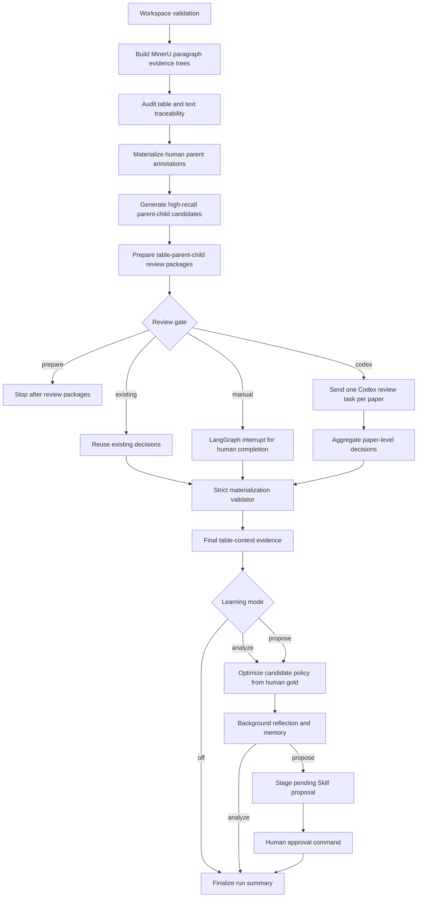

# TabRef Context Agent

`tabref-context-agent` is a LangGraph workflow agent for **auditable scientific
table-context identification** in the TabRefDetect project.

The agent is built for a real research problem: when a paper cites numerical
values from another paper's table, the numbers alone are not enough. To decide
whether a citation is correct, we also need the table-scoped context: model
names, datasets, metrics, prompts, shots, splits, baselines, training settings,
and result interpretations. This agent turns that long document-analysis
process into a traceable, resumable, human-in-the-loop workflow.

## Main Task

For each table in a scientific paper, the agent identifies the body-text child
blocks that describe or supplement the table. It preserves the complete parent
paragraph and original evidence trace for every selected child block, so later
models or annotators can judge whether a citing table refers to the same
experimental setting.

In short:

```text
table + caption + OCR paragraph tree
  -> high-recall parent/child candidates
  -> semantic precision review
  -> final table-context evidence
  -> human feedback and controlled self-learning
```

## Architecture Diagram



## Why This Agent Is Interesting

This is not a demo chatbot. It is a workflow agent designed around research
reproducibility and engineering safety:

- It combines deterministic document-processing tools with Codex-based semantic
  review.
- It uses LangGraph to make long-running document analysis explicit,
  resumable, and inspectable.
- It separates high-recall code rules from semantic precision judgments.
- It supports a controlled self-learning loop from human annotations.
- It stages Skill updates for human approval instead of silently rewriting its
  own behavior.

The result is an agent that can support both research experimentation and a
production-style review pipeline.

## Workflow

```text
validate_workspace
  -> build_evidence_trees
  -> audit_evidence_trees
  -> materialize_annotations
  -> build_recall_candidates
  -> prepare_review_packages
  -> review_gate
       -> prepare only
       -> existing decisions
       -> Codex review by paper
       -> manual interrupt
  -> materialize_results
  -> optional learning loop
       -> optimize_candidate_policy
       -> background_reflection
       -> stage_skill_update
  -> finalize
```

### Stage 1: Evidence Construction

The agent calls the reusable MinerU + PageIndex-style table-tree scripts. These
scripts preserve table captions, table bodies, page positions, bounding boxes,
reading order, section assignment, and full OCR paragraphs.

### Stage 2: High-Recall Candidate Generation

Deterministic code generates parent-paragraph and child-block candidates. The
code stage is deliberately recall-oriented: it keeps candidate evidence and
uses interpretable signals only to decide what should enter semantic review.

### Stage 3: Semantic Precision Review

The review gate can run in four modes:

- `prepare`: generate review packages without calling a model.
- `codex`: launch local `codex exec` review tasks.
- `existing`: validate and reuse existing decision files.
- `manual`: pause through a LangGraph interrupt for human completion.

Paper-level Codex review uses LangGraph `Send`, so independent papers can be
reviewed in parallel and joined at a strict validation barrier.

### Stage 4: Controlled Self-Learning

Version `0.3.0` adds a learning loop:

- Human child-level annotations are the only gold labels.
- Candidate-policy weights and thresholds can be optimized automatically when
  recall and per-table coverage guardrails pass.
- Memory and reflection files record human corrections and learned lessons.
- Skill text changes are never applied automatically. The agent stages a
  pending proposal, and a human must approve it before the live Skill changes.

This design borrows the useful parts of self-improving agents while keeping an
explicit approval gate.

## Main Features

- **LangGraph orchestration**: explicit nodes, conditional routing, and
  checkpointed state.
- **Parallel review**: paper-level `Send` fan-out with deterministic fan-in.
- **Human-in-the-loop control**: manual interrupt, approval commands, and
  preserved human gold.
- **Traceable outputs**: every child block keeps its full parent paragraph,
  table anchor, page metadata, and text hash.
- **Safe learning**: human-feedback-only policy optimization with recall
  guardrails.
- **Skill governance**: pending Skill proposals, version checks, and history
  snapshots before approval.
- **Model-replaceable design**: Codex review can later be replaced by a local
  classifier or reranker that emits the same decision schema.

## Resume-Friendly Metrics

| Dimension | Summary |
|---|---|
| Workflow graph | 14 LangGraph nodes with explicit routing and finalization |
| Review modes | `prepare`, `codex`, `existing`, `manual` |
| Learning modes | `off`, `analyze`, `propose` |
| Parallelism | Paper-level fan-out/fan-in with LangGraph `Send` |
| Governance | Skill proposals require human approval and history snapshots |
| Tests | 18 unit tests for config, routing, graph behavior, learning, and approval |
| Extensibility | Codex semantic review can be replaced by a local classifier or reranker |

## Repository Layout

```text
agent/tabref_context_agent/
  pyproject.toml
  config.example.json
  src/tabref_agent/
    cli.py
    config.py
    graph.py
    learning.py
    nodes.py
    state.py
    tools.py
  tests/
  scripts/run_agent.ps1
```

The deterministic table-tree and candidate-generation scripts live in:

```text
Code/MinerU_PageIndex_TableTree/
```

The matching Codex Skill lives in:

```text
skill/tabref-table-text-child-selector/
```

## Install

Run from `agent/tabref_context_agent`:

```bash
python -m venv .venv
.venv/Scripts/python -m pip install -e .
```

On Linux or macOS, use the corresponding virtual-environment activation path.

## Configure

Copy the example config and adjust paths for your local project layout:

```bash
cp config.example.json config.local.json
```

The released config assumes this repository layout:

```json
{
  "workspace_root": "../../Code/MinerU_PageIndex_TableTree",
  "selector_skill_dir": "~/.codex/skills/tabref-table-text-child-selector"
}
```

Important fields:

- `workspace_root`: directory containing the deterministic table-tree scripts.
- `manifest_path`: batch manifest for the papers to process.
- `review_mode`: `prepare`, `codex`, `existing`, or `manual`.
- `learning_mode`: `off`, `analyze`, or `propose`.
- `selector_skill_dir`: local Codex Skill directory used for semantic review.

`config.local.json` should remain local and must not contain secrets.

## Commands

Inspect the resolved plan:

```bash
python -m tabref_agent.cli plan --config config.local.json
```

Prepare review packages without calling a model:

```bash
python -m tabref_agent.cli run --config config.local.json --mode prepare
```

Run through local Codex:

```bash
python -m tabref_agent.cli run --config config.local.json --mode codex
```

Reuse existing decision files:

```bash
python -m tabref_agent.cli run --config config.local.json --mode existing
```

Inspect learning status:

```bash
python -m tabref_agent.cli learning-status --config config.local.json
```

Approve a pending Skill proposal after manual review:

```bash
python -m tabref_agent.cli approve-skill \
  --config config.local.json \
  --proposal-id <proposal-id> \
  --approver <name>
```

## Tests

```bash
python -m pytest -q
```

The tests cover config resolution, review routing, LangGraph compilation,
parallel `Send` behavior, learning metrics, and Skill proposal approval.

## Label Convention

- `0`: correct or relevant table-context evidence.
- `1`: incorrect or irrelevant evidence.

Human annotations are the only gold labels. Codex or local model decisions are
treated as provisional labels until evaluated against human feedback.

## Portfolio Highlights

This agent demonstrates practical agent engineering beyond prompt chaining:

- A real scientific-document workflow with long-running state.
- Clear boundaries between deterministic code, LLM judgment, and human gold.
- Parallel task execution with validation barriers.
- A self-learning loop that improves rules without bypassing human approval.
- A path toward replacing the Codex review stage with a local model.
